# UI Design Fundamentals

[Course by Gary Simon](https://scrimba.com/learn/design/)

- White Space
- Alignment
- Contrast
- Scale
- Typography
- Color
- Visual Hierarchy

## White Space

White Space is the empty space between the elements in your user interface

**Old Design**

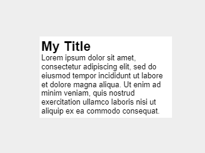

**New Design**

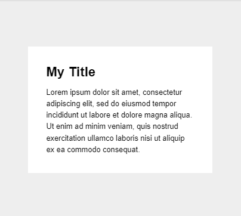

## Alignment

Alignment in UI design is the process ensuring that every element is positioned correctly in relation to other elements.

Each element in the UI defines a series of rows and columns.

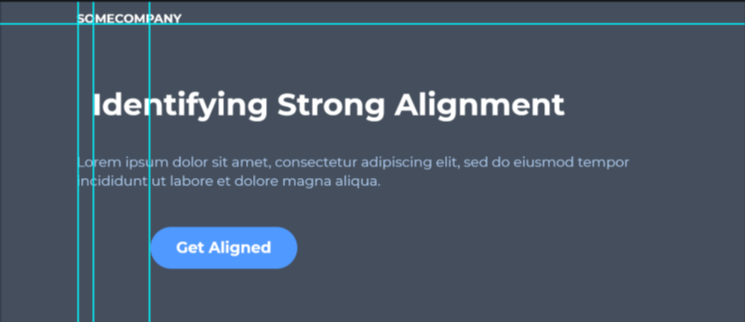

## Contrast

Contrast as defined as being in a ‘strikingly’ different state from something else.

### WCAG 2.0 Contrast Guidelines

WCAG - Web Content Accessibility Guidelines

**Minimum AA** : The visual presentation of text and images of text has a contrast ration of at least $4.5:1$, except for large text which should have a contrast ratio of at least $3:1$

**Enhanced AAA** : The visual presentation of text and images of text has a contrast ratio of at least $7:1$, expect for large text which should have a contrast ratio of at least $4.5:1$

**Contrast Checking Tools**

- Browser Plugins (Chrome, Firefox)
- Websites
- UI Designs Application Plugins

## Scale

The size of every UI element must be carefully considered.

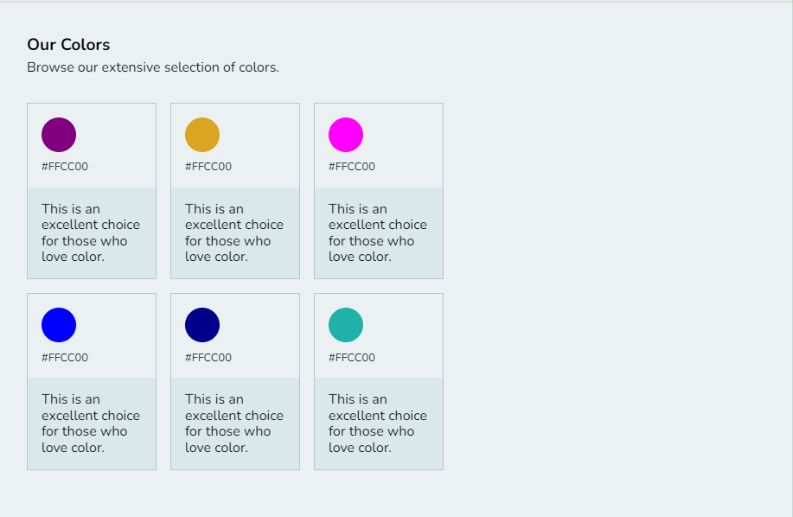

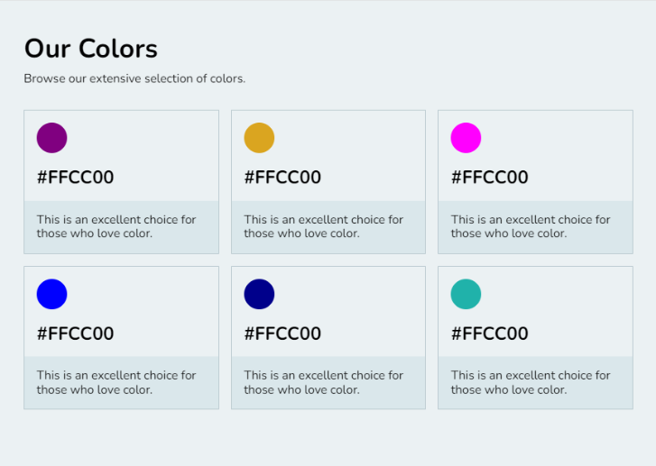

## Typography

Good typography requires the understanding of other fundamentals, along with few special considerations.

**Understanding Typography**

- Font Choice(s) - do not use more than 2 font families
- Visual Hierarchy
- Font size (scale)
- Alignment
- Letter spacing and line height
- Font style (weight, italics, etc.)
- Color and contrast

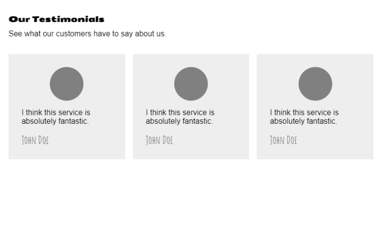

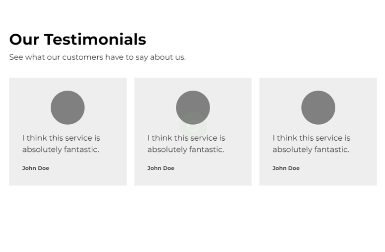

## Color

The first UI design fundamental that shapes a user’s experience is color.

**Important Notes**

- Green : wealth, nature, growth
- Black : luxury, sophistication, elegance
- Certain colors can mean different thing to different cultures
- Know your target audience and where they come from before deciding on the color
- What your business wants to project in terms of eliciting emotions
- Do not use too many colors
- Do not use colors which do not contrast well together
- Use different hues of same color to create distinction between elements of the page

**Bad Example**

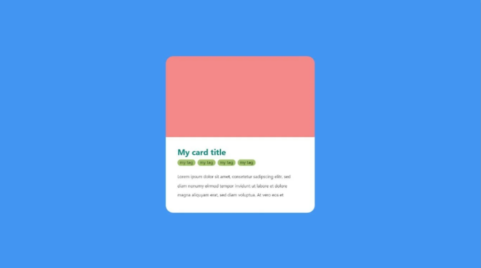

too many colors

bad contrast of colors

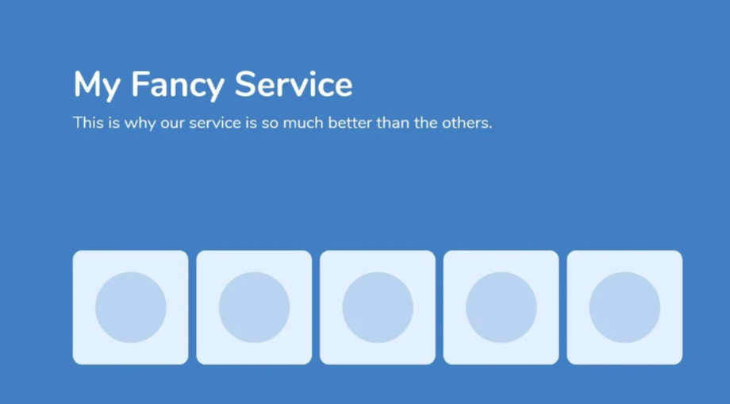

no hue

**Good Example**

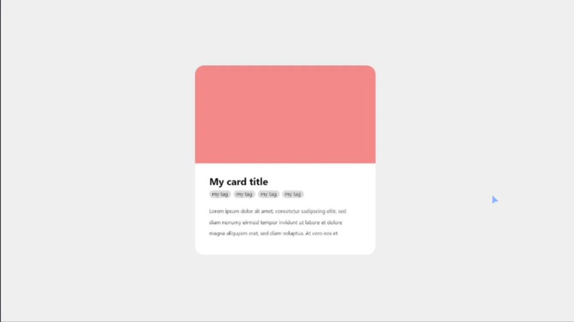

less colors

good contrast of colors

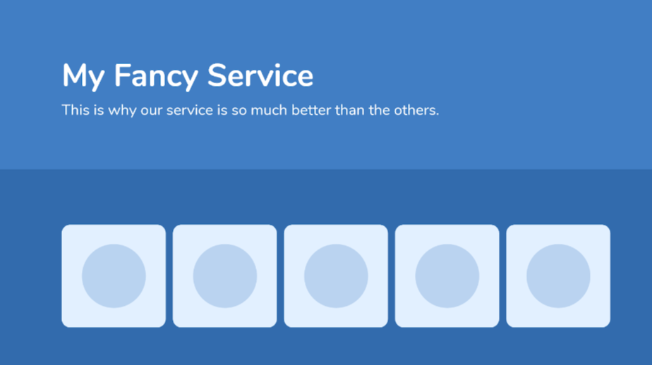

using hue for separation

## Visual Hierarchy

Every element on a user interface has a level of importance. Some elements are more important than others. Visual hierarchy is how we establish this importance.

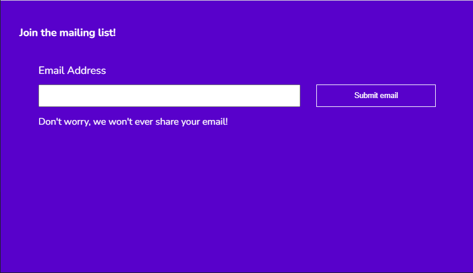

alignment

color

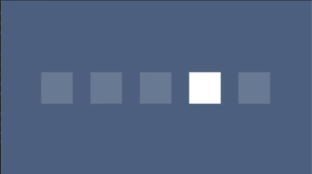

contrast

scale

scale and color

## Design Challenge 1

Based on White Space and Alignment

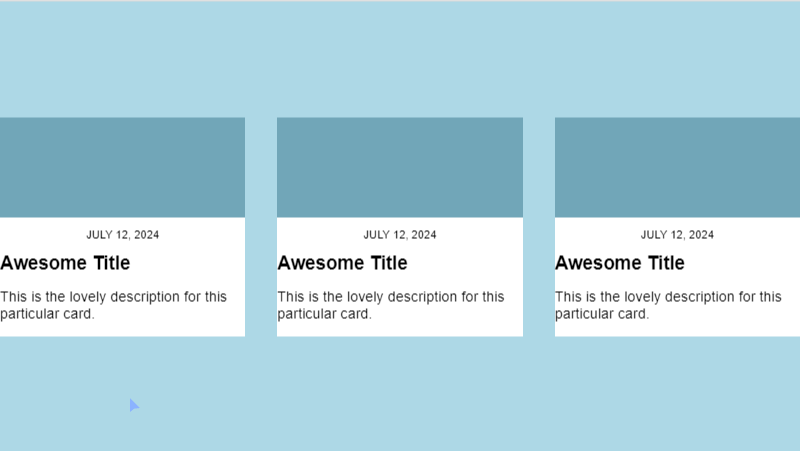

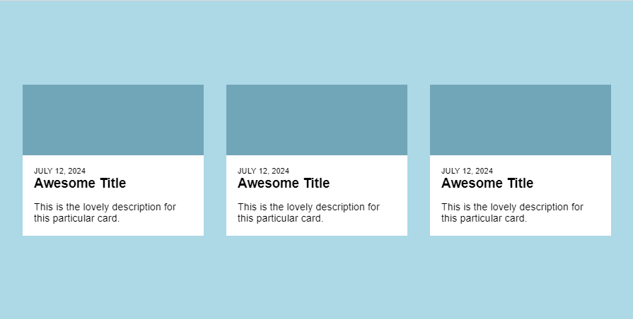

## Design Challenge 2

Based on Contrast and Scale

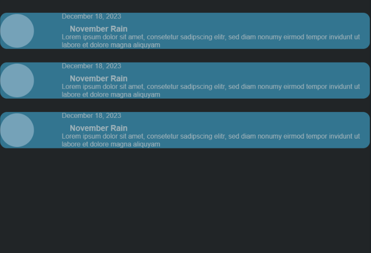

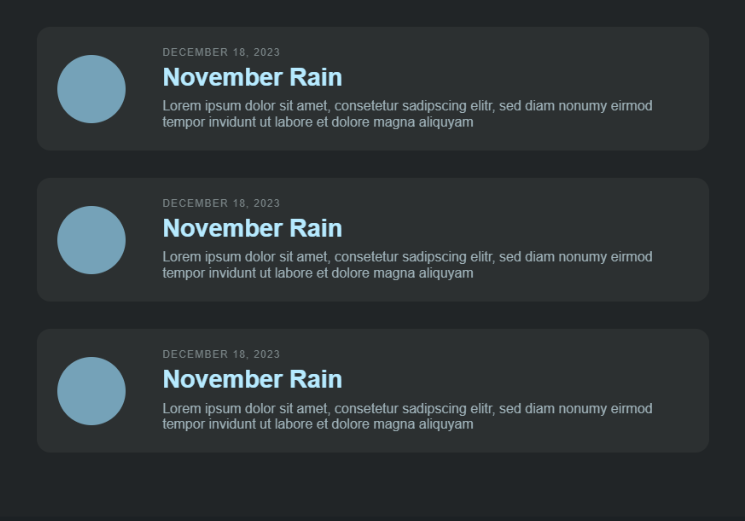

## Design Challenge 3

Based on Typography and Color

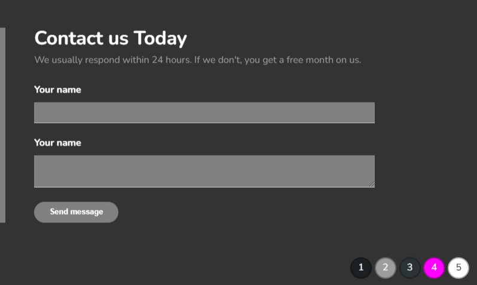

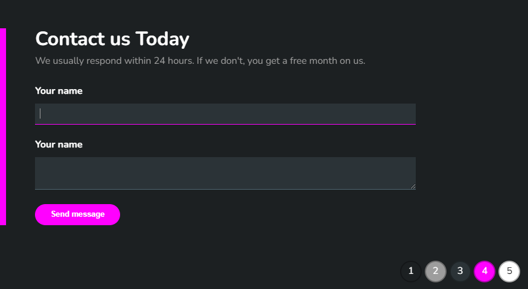

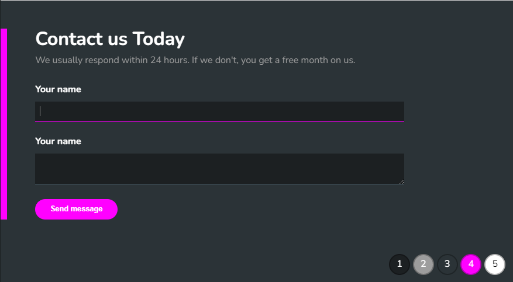

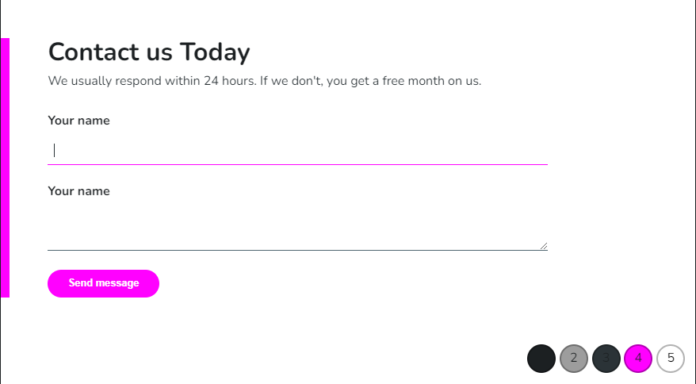

## Design Challenge 4

Based on Visual Hierarchy

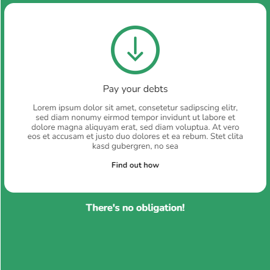

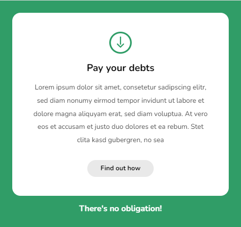

## Design Challenge 5

Based on Visual Hierarchy, Contrast, Alignment

